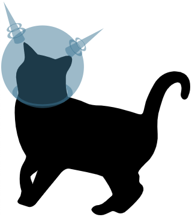

# pngpal

[](https://goreportcard.com/report/github.com/donatj/pngpal)
[](https://github.com/donatj/pngpal/actions/workflows/ci.yml)
[](https://godoc.org/github.com/donatj/pngpal)

Friendly command line tool to *losslessly* convert a PNG to a palleted PNG
if possible. It simply rejects images if it cannot be palletted losslessly.

Also usable as a library to convert images in general to paletted images.

## Examples

| PNG-24                             | PNG-8 (Palleted)                 | 
|------------------------------------|----------------------------------| 
|  |  | 
| 21kb                               | 9kb                              | 


## Usage

```bash
# Replace PNG in-place
$ pngpal file.png

# Save to new file
$ pngpal -o new.png old.png
```

## Installation

### Binaries

See: [Releases](https://github.com/donatj/pngpal/releases).

### From Source

```bash
$ go get -u -v github.com/donatj/pngpal/cmd/pngpal
```
